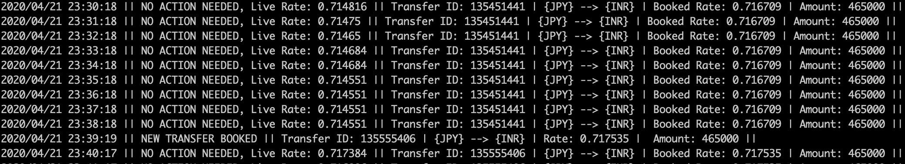
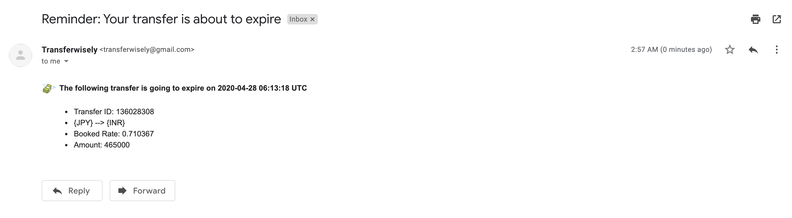

# transferwisely [](https://raw.githubusercontent.com/anuragdhingra/transferwisely/master/LICENSE) 
Batch process using transfer-wise API to automatically track, detect and book transfers for you at better rates.



### Why do we need this?
[Transferwise](https://transferwise.com/) is a leading online money transfer service. 
One can book a quote at live mid-market rate that further can be used to create a transfer. 
This transfer is a payment order to recipient account based on a quote. Once created, a transfer needs to be funded within the next five working days. Otherwise, it will be automatically canceled.
Its very easy to miss the best rates and kinda difficult to keep checking for them all the time if you are planning to make a transfer or if you do it too often, 
thus this was my naive attempt at solving this problem.


### Steps to follow
- Pull the pre-built image from [docker hub](https://hub.docker.com/r/anuragdhingra/transferwisely) using:

```bash
docker pull anuragdhingra/transferwisely:latest
```

- Run the image passing the following env variables:

```bash
docker run \
--name transferwisely-sandbox \
-d \
-e ENV=production \
-e API_TOKEN=<YOUR API TOKEN> \
-e MARGIN=0.001 \
-e INTERVAL=1 \
-e TO_MAIL=mymail@gmail.com \
-e FROM_MAIL=dummy@gmail.com \
-e MAIL_PASS=dummypassword \
anuragdhingra/transferwisely:latest
```

Required env vars -

`ENV`: `sandbox` or `production`

`API_TOKEN`: Generate it from [here](https://transferwise.com/help/19/transferwise-for-business/2958229/whats-a-personal-api-token-and-how-do-i-get-one).
_Note: Sandbox and production environment have different API Tokens. Also, make sure you use the `all_access` API token 
provided by transferwise. Whitelisting your server IP while creating the token is also recommended._

Optional env vars -

`MARGIN` (defaults to 0): Currency margin at which you want to book a new transfer, value defaults to 0 i.e 
any higher rate.
_(Please set it according to your respective currency rate change in absolute terms)_
For example when `MARGIN`is set as 0.01-
```
Current booked transfer : JPY --> INR : Rate --> 0.691
Live Rate --> 0.695 : NO ACTION NEEDED
Live Rate --> 0.711 : NEW TRANSFER BOOKED, cancelling the old one
```

`INTERVAL` (defaults to 1): Time(in minutes) interval at which you want to query transferwise to check for better rates

`TO_MAIL` : Mail address to send booked quote expiry reminder mail to i.e your email address. 

`FROM_MAIL`: Mail address to send booked quote expiry reminder mail from.

`MAIL_PASS` : Password for mail address used to send booked quote expiry reminder mail.

_Note: Please check additional info [here](#sending-quote-expiry-reminder-mail) on how to get `FROM_MAIL` and `MAIL_PASS`._

### Other things to note before using this on production:
- Currently, it doesnt supports creating a quote/transfer if there is no existing transfer at the moment. 
The reason to this being all the info regarding the new transfer to be made like recipient account,amount etc. 
is taken from the existing transfer.
- At the moment, as transferwise at maximum blocks live rate for first three of all your transfers booked.
Thus, the batch also gets only the first three or less existing transfers you have to compare for better rates.


### Sending quote expiry reminder mail
The batch also checks every 12 hours if your existing best booked quote is about to expire within next 36 hours.
Why 36 hours? Just because it should be enough time for us to decide on it.
Currently, the batch uses the free tier SMTP server provided by gmail. 
We strongly recommend to create a new gmail account that will be used to send these mails to your original email account 
and just pass the newly created gmail as `FROM_MAIL` and its password as `MAIL_PASS`. Also, to start 
receiving mails you'd need to enable [access to less secure app](https://support.google.com/a/answer/6260879?hl=en) 
on your newly created gmail account.




### Improvements
- Add testing
- Support creating a new transfer if no current transfer is present.
- Enable support for multi-source-amount, multi-currency quote tracking and booking from the same account.
- Alert user via notifications/SMS if a new transfer is booked on a better rate.

## Contributing
We welcome [issues](https://github.com/anuragdhingra/transferwisely/issues) to and [pull requests](https://github.com/anuragdhingra/transferwisely/pulls) against this repository! For further info regarding transferwise APIs checkout [TransferWise API docs](https://transferwise.github.io/api-docs-banks/#transferwise-for-banks-api).

## License
This project is licensed under the MIT License - read [LICENSE](LICENSE) file for details.

## Star and watch 
Watch this repository for updates and please give a star if you are using it or find it useful.


